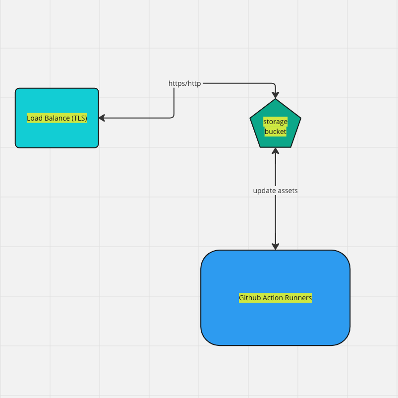

# LOAD BALANCER IP: 34.160.253.138

# CS1660 Static Website Project

## Project Requirements
- Google Cloud Platform (GCP) account
  - your educational credits are assigned via [Canvas](https://canvas.pitt.edu/courses/233982/discussion_topics/1232466)
- gcloud CLI
  - [installation instructions](https://cloud.google.com/sdk/docs/install)

## Project Description
The objective of this project is to deploy a static website on the Google Cloud Platform (GCP) using various GCP services, including:
- Google Cloud Storage for object storage to host the static website
- Load Balancer with a private SSL certificate for secure connections
- Implement a build pipeline using GitHub Actions (GHA) and Google Service Accounts
- Implement Workload Identity Federation to allow GHA to upload objects to the Google Cloud Storage bucket without static access keys

### GitHub Actions
We are using [Github Actions](https://docs.github.com/en/actions) to automatically build and deploy our assets to the Cloud Storage bucket.

My repository's Github Actions [workflow](https://github.com/dansc0de/dansc0de.run/blob/main/.github/workflows/ci.yaml) is configured to download code, setup Workload Identity Federation, and upload your assets to the Cloud Storage bucket. You need to create a workflow with the service account email address, and workload identity provider you create.

### Static Website
You can use any static website generator you want, or you can write the HTML/CSS/JS yourself. I am using [Hugo](https://gohugo.io/) to generate my website. The aim of this project is to leverage GCP services to host a static website, so the content of the website is not important.

## Project Architecture

## Project Requirements
- [ ] Create a static website using a static website generator or by writing the HTML/CSS/JS yourself
- [ ] Create a Google Cloud Storage bucket to host the static website
- [ ] Create a Google Cloud Load Balancer to serve the static website with a private SSL certificate (that will be provided by me!)
  - The site should be accessible via HTTPS
  - All traffic on HTTP should be redirected to HTTPS
  - Do not enable Cloud CDN (Content Delivery Network)
- [ ] Create a Google Service Account to use with GitHub Actions
  - The service account should have the `Storage Object Admin` role
  - The service account should have the `Service Account User` role
- [ ] Create a Workload Identity Pool and Provider
  - The provider should be configured to use the service account created above to upload objects to the Google Cloud Storage bucket without static access keys

## Project Submission
- [ ] Create a public GitHub repository for your project
- [ ] Submit a link to your GitHub repository on Canvas

## Helpful Tutorials
- This [tutorial](https://cloud.google.com/storage/docs/hosting-static-website#command-line_1) shows how to set up your Cloud Storage bucket, Load Balancer, and SSL certificate
  - Your SSL private key and certificate will be provided by me
- This [tutorial](https://github.com/google-github-actions/auth#setting-up-workload-identity-federation) shows how to set up the Service Account, and Workload Identity Pool and Provider

## Grading
The project is worth 15 points and the following rubric will be used to grade your project:

| Objectives                                                                      | Points |
|---------------------------------------------------------------------------------|--------|
| Create static website                                                           | 3      |
| Create Cloud Storage Bucket                                                     | 3      |
| Create Load Balancer with Redirect and SSL Termination                          | 3      |
| Create Service Account                                                          | 3      |
| Create Working Github Actions Pipeline with Workload Identity Pool and Provider | 3      |
| Total                                                                           | 15     |

## Notes
- I am using an opensource project called [Hugo](https://gohugo.io/installation/) to generate my static website.
  - my repository is [here](https://github.com/dansc0de/dansc0de.run) and it is on the [internet](htttps://dansc0de.run)
- Once your static website is in the Cloud Storage bucket, you can access it via the public URL
  - `https://storage.googleapis.com/<your-bucket-name>/index.html`
- You can use the following command to upload your assets to the Cloud Storage bucket before the GitHub Actions workflow is configured.
  - `gcloud storage cp . gs://<YOUR_STORAGE_BUCKET> -r`